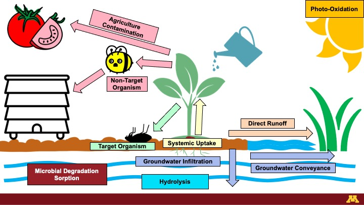

<title> Grant Goedjen Welcome Page </title>

<body>
<link rel="stylesheet" href="./stylesheets/normalize.css"> 

<h1>Welcome!</h1>

Welcome to my personal research page! Here you can find my most recent work, presentations, awards, and publications from the Arnold Lab Group! 

<h1>About Me:</h1>
I am a current doctoral candidate with the Arnold Research laboratory at the University of Minnesota Department of Civil, Environmental and Geo Engineering and a certified EIT in the states of Minnesota and Texas. I hail from the great state of Texas where I studies Environmental Engineering at Texas Tech University where i received my Masters and Bachelors of Environmental Engineering. After I complete my work here at UMN I hope to continue my work as a post-doctoral scholar before going to work as a subject expert in hazardous waste site investigation and remediation. My current research (<a href="#interest">highlighted below</a>) focuses on environmental fate and transport of two classes of insecticides: <b><em>Neonicotinoids and Fipronil</em></b>. My research aims to identify the extent of neonicotinoid and fipronil presence in natural surface and groundwater and soil systems and track their degradation and removal through different treatment and remediation strategies.

<h1>A Special Thank You</h1>

Before we get into it, I would like to thank all of my undergraduate lab assistants without whom this research would not be possible. Sylvia, Sydney, Joe, Tim, and Nam have been critical to preparing and processing the hundreds of water samples we get each year. Without them, I never would have gotten this far on my research.

    

I would also like to thank the Arnold lab group. This amazing group of individuals have been the keystone of my sanity navigating graduate school in the middle of a global pandemic and the countless "upresidented times" we've faced the last two years. Their support, advice, and friendship has meant the world to me and I would not have made it this far without them.

    

<h1><a id = "interest">Research Interests</a></h1>

My research focuses on occurrence and fate of first generation of neonicotinoids (i.e. classical neonicotinoids) and  fipronil insecticides in environs. My main research focuses include:

<ul>
  <li>Fate in surface water systems.</li>
  <li>Fate in groundwater systems.</li>
  <li>Transport processes via surface runoff and groundwater infiltration.</li>
  <li>Fate and removal by conventional and advanced drinking water treatment plants. </li>
  <li>Occurrence, fate, and removal by activated sludge and membrane bio reactor-equipped (MBR) waste water treatment plants.</li>
  <li>Occurrence, fate, and degradation by industrial and residential-scale composting operations.</li>
</ul>

<h2>What are Neonicotinoids?</h2>

  

"Neo" meaning "new" and nicotinoids meaning "Nicotine-Like":
Neonicotinoids are a suite of systemic pesticides first derived from nicotine in the early 1990's and are now one of the most frequently-applied pesticides in the world! The most common neonicotinoids include:<b><em>Imidacloprid, Clothianidin, Thiamethoxam, Thiacloprid, and Acetamiprid</em></b>. Chances are if you've eaten produce or food produced using grain in the last 30 years, then chances are you've eaten something containing neonicotinoids! 

  
  
 (Minnesota Dept. Agriculture 2019)

Neonicotinoids are by-far the most popular pesticide used in Minnesota agriculture With 90,000 pounds of pure product sold in 2019 alone. The most common applications of neonicotinoids include:

<ul>
  <li>Seed coatings, spray treatments, and soil treatments for agricultural operations,
- direct injections for the spot treatment of nuisance diseases in woody plants,</li>
  <li>termite prevention and wood preservation,</li>
  <li>flea and tick medications,</li>
  <li>bedbug treatments, </li>
  <li>and more!</li>
</ul>

Neonicotinoids are a systemic pesticide, meaning that instead of just hanging around on the surface of the plant or in the soil, the insecticides are taken up and metabolized by the plant! Just like nicotine, neonicotinoids bind to the nicotinic acetylcholine receptor in the central nervous system. While this has a limited reaction in larger mammals, this can cause paralysis, seizures, and eventually death in insects! Ideally that would mean that neonicotinoids should be taken up and trapped in the body of the plant and only effect smaller pest insects without effecting larger organisms; Unfortunately that is often not the case. While much of the applied insecticides do remain in the body of the plant, it is not uncommon to find them where they shouldn't be! Our lab has detected them at appreciable concentrations all over, including in many of Minnesota's lakes, rivers, and springs. We even find them in waste water and drinking water plants! To learn more, check out our paper on <a href="https://hdl.handle.net/11299/220617"><it>Neonicotinoids in Minnesota Surface Waters</it></a> and take a look at my latest poster to be presented at the 2022 Gordon Research Conference on Water Chemistry! That not all, Neonicotinoids have been found in <a href = "https://doi.org/10.1021/jf501397m">grocery store produce</a>,
 <a href = "https://doi.org/10.1016/j.jeem.2020.102320">agricultural products</a>, <a href = "https://doi.org/10.1016/j.biocontrol.2009.09.001">non-target insects</a>, <a href = "https://doi.org/10.1016/j.jchromb.2015.03.016">honey</a>, <a href = "https://doi.org/10.1021/jf404100x">tea</a>, <a href = "https://link.springer.com/article/10.1007/s10646-012-0863-x">pollinators</a>, <a href = "https://doi.org/10.1016/j.envpol.2018.04.144">human bodily fluids</a>, <a href = "https://doi.org/10.1016/j.ecoenv.2021.112001">blood</a>, <a href = "https://doi.org/10.1016/j.scitotenv.2021.151407">seminal fluid</a>, and in <a href = "https://doi.org/10.1016/j.scitotenv.2021.151806">pregnant women</a>. Just about everything that comes into contact pesticides directly or indirectly seems to have at least a bit of neonicotinoid in them.

<h2>What is Fipronil?</h2>

  

Like neonicotinoids, fipronil and it's related compounds are insecticides commonly used in agriculture. First derived in 1996, fipronil is used at much lower rates than neonicotinoids and are typically focused in urban and residential areas. Common uses include:

<ul>
  <li>spray treatments for agricultural operations,</li>
  <li>direct injections for the spot treatment of nuisance diseases in woody plants,</li>
  <li>termite prevention and wood preservation,</li>
  <li>flea and tick medications,</li>
  <li>bedbug treatments, </li>
  <li>and more!</li>
</ul>

Unlike neonicotinoids, however, fipronil is a broad-spectrum insecticide which can effect organisms indiscriminately. Fipronil blocks the gabaa-gated chloride (Cl-) channels in the central nervous system of any organism unfortunate enough to be exposed and results in paralysis, seizures, and death. The lower specificity of fipronil means that a much wider suite of organisms may, and are, negatively effected. Fipronil has had observational effects on a large variety of organisms, and while it generally is not toxic to humans at low concentrations, has significantly impacted smaller non-target organisms including <a href = "https://doi.org/10.1016/j.envpol.2019.05.067">fish and aquatic organisms</a> and <a href = "https://doi.org/10.1016/j.scitotenv.2021.148678">pollinators</a>.

<h2>Environmental Fate</h2>

  

<h3>Neonicotinoids</h3>

Neonicotinoids are highly soluble in water and experience high rates of transport as surface runoff or infiltration. Once in the water, they can survive thousands of days before degrading into one of their many degradation products and can be conveyed significant distances through streams and in groundwater, reemerging in lakes or in natural springs. In the water they can undergo hydrolysis, in which water molecules react with them to form dozens of primary transformation products. If they don't end up in water, sediment, particularly high-organic sediment, has shown to have a high sorption capacity for neonicotinoids; Meaning that neonicotinoids can hang around on soil and sediment particles until they are metabolized by bacteria or swept away in water. If left on the surface, neonicotinoids are susceptible to direct and indirect photolysis and can form a suite of products with many of the same characteristics, including similar toxicity. Finally, the neonicotinoids that make it into the body of the plant may remain in the plant and either end up in the final agricultural product and be processed into food products of remain in the root systems and either be composted or left to degrade in the field. Of course, nuisance insects may also eat the plants and be effected, but non-target insects such as pollinators may eat pesticide-containing plant material and be negatively impacted or return pollen to the hive where it may end up in they honey. 
Luckily, though, neonicotinoids have very small Henry's constants and do not volatilize regularly into the air - one less thing for us to worry about!

<h3>Fipronil</h3> 

Fipronil has a comparatively lower solubility in water and significantly higher sorption to soils and sediments. Fipronil's moderately hydrophobic structure means that it readily partitions to soil and has limited transport in water and air. Strong sorption to solids leads to a high fraction of fipronil retained in soil, sediment, and compost with few available routes from horizontal transfer to other media. That being said, fipronil has been observed at lower concentrations but at similar rates to neonicotinoids and other insecticides and it believed to use particulate in water and air to hitch a ride in streams and wind to contaminated secondary locations. 

<h2>Why Should You Care?</h2>

While neonicotinoids are found in a huge variety of foods, they are at <b><em>very</em></b> low concentrations - we're talking ng/L and ng/kg concentrations! While the harmful dosage is generally in the ug/kg range. That being said, not a whole lot is understood about neonicotinoid toxicity towards humans - so keep yourself informed on the latest research and always wash your produce!

The widespread occurrence of neonicotinoids, even at these low concentrations, are not something that should be ignored, however. While these low concentrations of insecticides aren't believed to be harmful to humans, they can wreck havoc on non-target insects and pollinators, including bees. It has been such a prevalent issue that the European Union even <a href="https://ec.europa.eu/food/plants/pesticides/approval-active-substances/renewal-approval/neonicotinoids_en">banned the use of neonicotinoids for agricultural production in 2013</a>. So while we don't have to worry about direct toxicity to humans, we certainly should begin looking  for less harmful alternatives to help protect our pollinator friends!

<h1>Recent Presentations</h1>
<h2>Gordon Research Conference</h2>

  

<h2>American Chemical Society Spring 2022</h2>
Pesticides in Minnesota’s Surface and Groundwater: Neonicotinoids, Fipronil, and Key Transformation Products.

<h2>American Chemical Society Spring 2021</h2>
Neonicotinoids Insecticides in Minnesota Surface and Groundwater: Occurrence, Trends, and Future Work 

<h1>Recent Awards</h1>

Thank you to the <a href = "https://www.compostfoundation.org/Research/College-Scholarships">Compost Research and Educational Foundation</a> for their generous contributions in recognition of my research on pesticide fate in commercial composting operations!

<h1>Publications</h1>

Take a look at the interesting work going on in the <a href = "https://williamarnold.org">Arnold Lab Group</a>! Our latest work are listed below.Doctoral dissertation, Wilmington University]

Berens, M.B. 2020. <a href = "https://hdl.handle.net/11299/220617"><em>Exploring the Reactions and Presence of Munitions Compounds and Insecticides in Aquatic Systems</em></a>[Doctoral Disserdation, University of Minnesota]. University of Minnesota Digital Conservatory.

Berens, M.B., Capel, P.D., Arnold, W.A. 2021. <a href = "https://setac.onlinelibrary.wiley.com/doi/10.1002/etc.4959"><em>Neonicotinoid Insecticides in Surface Water, Groundwater, and Wastewater across Land Use Gradients and Potential Effects.</em></a> Environ. Tox. Chem. 40(4)1017-1033. Open Access. 
<a href = "https://doi.org/10.13020/760y-wc14">Download the data!</a>

Todey, S.A., Fallon, A.M., Arnold, W.A. <a href = "https://doi.org/10.1002/etc.4959"><em>Neonicotinoid insecticide hydrolysis and photolysis: Rates and residual toxicity.</em></a> Environ. Toxicol. Chem.  37(11), 2797-2809. Data repository for UMN data set. Open Access.
<a href = "https://doi.org/10.13020/D6XQ2S">Download the data!</a>

<h1>Contact Information</h1>
<h2>Email</h2>
Questions about my research? Reach out to me by <a href = "mailto:Goedj011@umn.edu">email</a>
<h2>Arnold Lab Website</h2>
See the latest work going on our <a href = "https://williamarnold.org">lab website</a>

Last Updated: 2022.06.18
</body>