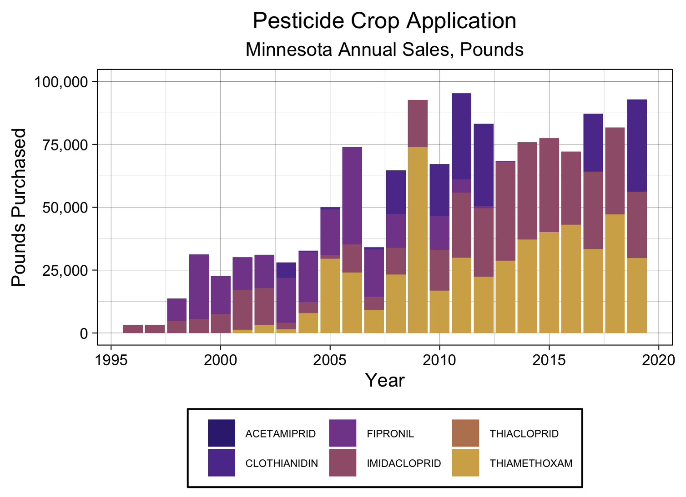

<body>
<link rel="stylesheet" href="./stylesheets/normalize.css"> 

# Welcome! 

Welcome to my personal research page! Here you can find my most recent work, presentations, awards, and publications from the Arnold Lab Group!

# A Special Thank You

Before we get into it, I would like to thank all of my undergradate lab assistants without whom this resaerch would not be possible. Sylvia, Sydney, Joe, Tim, and Nam have been critical to preparing and processing the hundreds of water samples we get each year. Without them, I never would have gotten this far on my research.

    

I would also like to thank the Arnold lab group. This amazing group of individuals have been the keystone of my sanity navigating gradschool in the middle of a globoal pandemic and the counless "upresidented times" we've faced the last two years. Their support, advice, and friendship has meant the world to me and I would not have made it this far without them.

    

# Research Intersts

My research focuses on occurence and fate of first generation of neonicotinoids (i.e. classical neoncotinoids) and  fipronil insecticides in environs. My main research focuses include:

- Fate in surface water systems.
- Fate in groundwater systesm.
- Transport processes via surface runoff and groundwater infiltration.
- Fate and removal by conventional and advanced drinking water treatment plants. 
- Occurence, fate, and removal by activated sludge and membrane bioreactor-equipped (MBR) waste water treatment plants.
- Occurrence, fate, and degradation by industrial and residential-scale composting operations.

## What are Neonicotinoids?

  

"Neo" meaning "new" and nicotinoids meaning "Nicotine-Like":
Neoniotinoids are a suite of systemic pesticides first derived from nicotine in the early 1990's and are now one of the most frequently-applied pesticides in the world! The most common neonicotinoids include: **Imidacloprid, Clothianidin, Thiamethoxam, Thiacloprid, and Acetamiprid**. Chances are if you've eaten produce or food produced using grain in the last 30 years, then chances are you've eaten something containing neonicinoids! 

  
  
 (Minnesota Dept. Agriculture 2019)

Neonicotinoids are by-far the most popular pesticide used in Minnesota agriculture With 90,000 pounds of pure product sold in 2019 alone. The most common applications of neonicotinoids include:
- seed coatings, spray treatments, and soil treatments for agricultural operations,
- direct injections for the spot treatment of nuisance diseases in woody plants,
- termite prevention and wood preservation,
- flea and tick medications,
- bedbug treatments, 
- and more!

Neonicotinoids are a systemic pesticide, meaning that instead of just hanging around on the surface of the plant or in the soil, the insecticides are taken up and metabolized by the plant! Just like nicotine, neonicotinoids bind to the nicotinic acetylcholine receptor in the central nervous system. While this has a limited reaction in larger mammals, this can cause paralysis, siezures, and eventually death in insects! Ideally that would mean that neonicotinoids should be taken up and trapped in the body of the plant and only effect smaller pest insects without effecting larger organisms; Unfortunately that is often not the case. WHile much of the applied insecticides do remain in the body of the plant, it is not uncommon to find them where they shouldn't be! Our lab has detected them at appreciable concentrations all over, including in many of Minnesota's lakes, rivers, and springs. We even find them in wastewater and drinking water plants! To learn more, check out our paper on [*Neonicotinoids in Minnesota Surface Waters*](https://hdl.handle.net/11299/220617) and take a look at my latest poster to be presented at the 2022 Gordon Research Conference on Water Chemistry! That not all, Neonicotinoids have been found in  [grocery store produce](https://doi.org/10.1021/jf501397m), [agricultural products](https://doi.org/10.1016/j.jeem.2020.102320), [non-target insects](https://doi.org/10.1016/j.biocontrol.2009.09.001), [honey](https://doi.org/10.1016/j.jchromb.2015.03.016), [tea](https://doi.org/10.1021/jf404100x), [pollinators](https://link.springer.com/article/10.1007/s10646-012-0863-x), [human excriment, feces, and urine](https://doi.org/10.1016/j.envpol.2018.04.144), [human blood](https://doi.org/10.1016/j.ecoenv.2021.112001), and even in [human sperm](https://doi.org/10.1016/j.scitotenv.2021.151407) and [embryonic fluid!](https://doi.org/10.1016/j.scitotenv.2021.151806). Just about everyhint that comes into contact pesticides directly or indirectly seems to have at least a bit of neonicotinoid in them.

---

## What is Fipronil?

  

Like neonicotinoids, fipronil and it's related compounds are insecticides commonly used in agriculture. First derived in 1996, fipronil is used at much lower rates than neoicotinoids and are typically focuesed in urban and residential areas. Common uses include:

- spray treatments for agricultural operations,
- direct injections for the spot treatment of nuisance diseases in woody plants,
- termite prevention and wood preservation,
- flea and tick medications,
- bedbug treatments, 
- and more!

Unlike neonicotinoids, however, fipronil is a broad-spectrum insecticide which can effect organisms indiscriminantly. Fipronil blocks the gabaa-gated chloride (Cl-) channels in the central nervous system of any organism unfortunate enough to be exposed and results in paralysis, siezures, and death. The lower specificity of fipronil means that a much wider suite of organissm may, and are, negatively effected. Fipronil has had observational effects on a large variety of organisms, and while it generally is not toxic to humans at low concentrations, has significantly impacted smaller nontarget organisms includeing [fish and aquatic organisms](https://doi.org/10.1016/j.envpol.2019.05.067) and [pollinators](https://doi.org/10.1016/j.scitotenv.2021.148678).

---

## Environmental Fate

  

### Neonicotinoids

After applied as either a seed coating or spray treatments, there are several avenues which neonicotnoids may take to move around the environment.

Neonicotnioids are highly soluble in water and experince high rates of transport as surface runoff or infiltration. Once in the water, they can survive thousands of days before degrading into one of their many degradants and can be conveyed significant distances thorugh sttreams and in groundwater, reemerging in lakes or in natural springs. In the water they can undergo hydrolysis, in which water molecules react with them to form dozens of primary transformation products. If they don't end up in water, sediment, particularly high-organic sedient, has showns to have a high sorption capacity for neonicotinoids; Meaning that neonicotinoids can hang aronud on soil and sediemt particles until they are metabolized by bacteria or swept away in water. If left on the surface, neonicotinoids are susceptable to direct and indirect photolysis and can form a suite of prodcuts with many of the same characteristics, including similar toxicity. Finally, the neonicotoinds that make it into the body of the plant may remain in the plant and iether end up in the final agricultural product and be processed into food products of remain in the root systems and either be composted or left to degrade in the field. Of course, nuisance insects may also eat the plants and be effected, but nontarget insects such as pollinators may eat pesticide-containing plant material and be negativiely impacted or return pollen to the hive where it may end up in they honey. 
Luckily, though, neoncitnoids have very small henry's constants and do not volatilize regularly into the air - one less thing for us to worry about!

### Fipronil

## Why should I care?

While neonicotinoids are found in a huge variety of foods, they are at ***very*** low concentrations - we're talking ng/L and ng/kg concentrations! WHile the harmful dosage is generally in the ug/kg range. That being said, not a whole lot is understood about neonicotinoid toxicity towards humans - so keep yourself informed on the latest research and always wash your produce!

The widespead occurence of neonicotinoids, evem at these low concentrations, are not something that should be ignored, however. WHile these low concentraitons of insecticides aren't believed to be harmful to humans, they can wreck havoc on nontarget insects and pollinators, including bees. It has been such a prevelent issue that the European Union even [banned the use of neonicotinoids for agricultural production in 2013](https://ec.europa.eu/food/plants/pesticides/approval-active-substances/renewal-approval/neonicotinoids_en). So while we dopn't have to worry about direct toxicity to humans, we certainly should begin looking  for less harmful alternatires to help protect our pollinator friends!

<a href="[url](https://ec.europa.eu/food/plants/pesticides/approval-active-substances/renewal-approval/neonicotinoids_en)">banned the use of neonicotinoids for agricultural production in 2013</a>

<!---

## My Research

### Insecticides in Surface Water.

Coming Soon! 

### Insecticides in Groundwater.

Coming Soon! 

### Insecticides in Drinking Water and Wasteater Treatment Plants.

Coming Soon! 

### Insecticides in Commercial, Residential, and Field Composting Systems.

Coming Soon! 
-->

# Recent Presentations
## Gordon Research Conference

  

## American Chemical Society Spring 2022
Pesticides in Minnesota’s Surface and Groundwater: Neonicotinoids, Fipronil, and Key Transformation Products.

## American Chemical Society Spring 2021
Neonicotinoid Insecticides in Minnesota Surface and Groundwater: Occurance, Trends, and Future Work 

# Recent Awards

Thank you to the [Compost Research and Educational Foundation](https://www.compostfoundation.org/Research/College-Scholarships) for their generous contributions in recognition of my research on pesticide fate in commercial composting operations!

# Publications

Take a look at the interesting work going on in the [Arnold Lab Group](https://williamarnold.org)! Our latest work are listed below.Doctoral dissertation, Wilmington University]

Berens, M.B. 2020. [Exploring the Reactions and Presence of Munitions Compounds and Insecticides in Aquatic Systems](https://hdl.handle.net/11299/220617)[Doctoral Disserdation, University of Minnesota]. University of Minnesota Digital Conservatory.

Berens, M.B., Capel, P.D., Arnold, W.A. 2021. [Neonicotinoid Insecticides in Surface Water, Groundwater, and Wastewater across Land Use Gradients and Potential Effects.](https://setac.onlinelibrary.wiley.com/doi/10.1002/etc.4959) Environ. Tox. Chem. 40(4)1017-1033. Open Access. 
[Download the associated data!](https://doi.org/10.13020/760y-wc14).

Todey, S.A., Fallon, A.M., Arnold, W.A. [Neonicotinoid insecticide hydrolysis and photolysis: Rates and residual toxicity.](https://doi.org/10.1002/etc.4959) Environ. Toxicol. Chem.  37(11), 2797-2809. Data repository for UMN data set. Open Access.
[Download the associated data!](https://doi.org/10.13020/D6XQ2S)

# Contact Information
## Email
Questions about my research? Reach out to me by email [here!](mailto:Goedj011@umn.edu)
## Lab Website
See the latest work going on in our lab [here!](https://williamarnold.org)

---
Last  Updated: 2022.06.19
<body/>